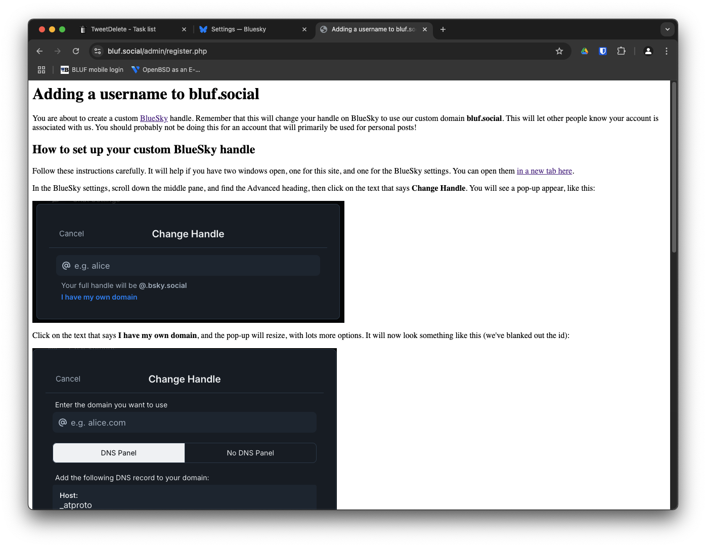

# A simple resolver and admin page for BlueSky custom domains

The purpose of these scripts is to provide a straightforward way to allow users of your
domain to set themselves up with custom BlueSky handles matching that domain.

Rather than relying on creating lots of DNS records, this project uses the alternative 
means of resolving a handle, via the .well-known path, which is outlined 
[in this blog post](https://bsky.social/about/blog/4-28-2023-domain-handle-tutorial).

Since that might be a bit complicated for some people who could nevertheless benefit 
from doing this, I created these simple scripts and instructions to help make it easier
for others.

I have put in very little effort at making the pages look stylish, but feel free to
take this work and adapt it for your own purposes. Or porpoises, because we probably
need more cetaceans on BlueSky.

## What's going on?
At its heart, what I have here is an SQLite database, which stores names in our custom
domain, and matching identifiers for BlueSky accounts.

When queried via the .well-known/atproto-did, the resolve.php script returns the appropriate
information, allowing the custom handle to be verified.

There is a set of admin pages, which allows you to see what names have been used already,
and a register page which provides a step by step guide, with screenshots, so that users
are told what to click, and what information to copy and paste. This should make it
pretty simple for any of your users to sign up with BlueSky and then change their handle
to one in your custom domain.

## Requirements
The scripts have been tested using PHP 8.2, but should work ok with other. You will need
the SQLite3 PHP extension. 

You'll also need a webserver set up for your domain, with a wildcard for subdomains; this
may be a suitable time to go grab something like a .social domain to use for this, which is 
what we did at BLUF.

You should set up SSL, with a free certificate that handled the domain and all its wildcards,
and you'll need to redirect all queries to the .well-known URL to the resolv.php script.

An example Apache [vhost](vhost.conf) file is included.

## Configuration
There are a few options in the config.php file, which are designed to make this simple to 
set up for your own domain.

set BSKY_DOMAIN to the custom domain your handles will be in, like bluf.social

This is used in most of the pages, to ensure people see the correct name of the handles you
are creating, most specifically in the step by step instructions.

set REDIRECT_TO to your main domain

This is so you don't need to make a landing page for your new domain, if you're lazy, otherwise
you don't need to worry about it.

set ADMIN_PASSWORD to something that is shared with only those who need to know.

This is a VERY basic authentication system for the admin pages; it's as an example only, and
for any organisation with more than a few people, you probably ought to think about better ways
to protect the admin directory, and control who is allowed to create a custom handle under
your domain. 

*NOTE:* You will almost certainly need to make sure that the user under which the web server
runs has write permissions in the admin folder, so that it can create and update the SQLite
database.
